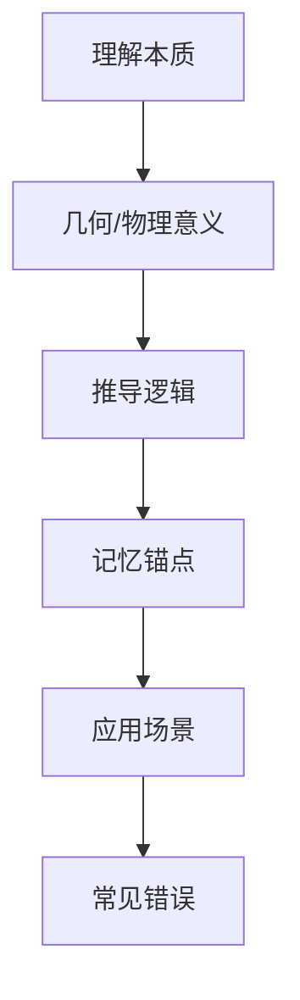
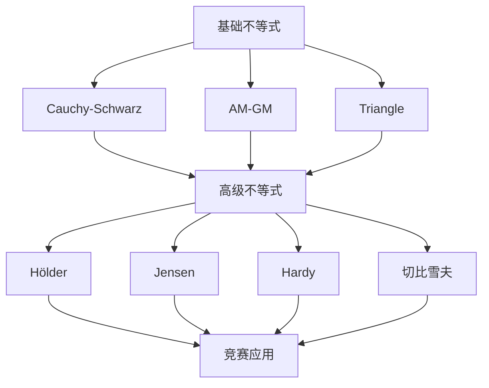
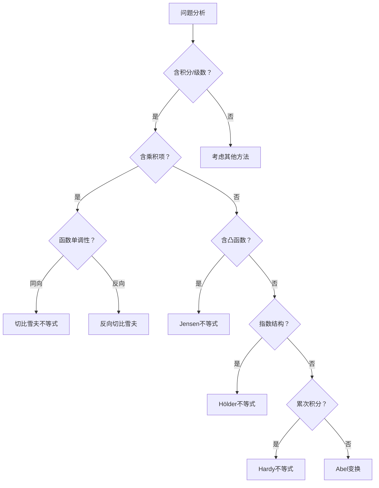
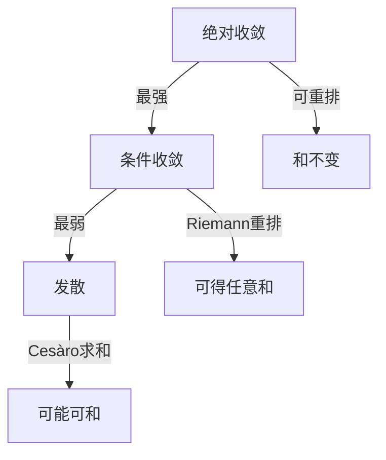

# 数学核心公式深度记忆手册
## ——从本质理解到记忆技巧的完美融合

> **记忆哲学**：公式不是死记硬背的符号，而是数学家智慧的结晶。理解其物理意义、几何直观和推导逻辑，配合巧妙的记忆锚点，才能真正内化为解题本能。

---

## 一、傅里叶级数与收敛定理

### 1.1 傅里叶级数公式
**标准形式**：
$$f(x) \sim \frac{a_0}{2} + \sum_{n=1}^{\infty} (a_n\cos nx + b_n\sin nx)$$
**系数公式**：
$$a_n = \frac{1}{\pi}\int_{-\pi}^{\pi} f(x)\cos nx\,dx,\quad b_n = \frac{1}{\pi}\int_{-\pi}^{\pi} f(x)\sin nx\,dx$$

### 1.2 记忆技巧
**🎯 三步记忆法**：
1. **"偶余奇正"**：$a_n$ 配 $\cos$（偶函数），$b_n$ 配 $\sin$（奇函数）
2. **"积分区间对称，系数分母是 $\pi$"**：记住 $\frac{1}{\pi}$ 而不是 $\frac{1}{2\pi}$
3. **"$a_0$ 要除2"**：常数项 $\frac{a_0}{2}$ 是平均值，单独记忆

**🧠 几何联想**：  
想象 $f(x)$ 是一个周期信号，傅里叶级数就是用不同频率的正弦波（基音 + 泛音）叠加来逼近它。$a_n$ 和 $b_n$ 就是每个频率分量的"音量大小"。

### 1.3 收敛定理（狄利克雷条件）
**核心条件**：
- $f(x)$ 在 $[-\pi, \pi]$ 上**分段光滑**（有限个第一类间断点，有限个极值点）
- **收敛结论**：
  - 在连续点 $x_0$：级数收敛于 $f(x_0)$
  - 在间断点 $x_0$：级数收敛于 $\frac{f(x_0^+)+f(x_0^-)}{2}$

**💡 记忆口诀**：  
**"分段光滑保收敛，连续等于函数值，间断取平均"**

**⚠️ 易错点**：  
吉布斯现象——在间断点附近，部分和会有约9%的过冲，且不随项数增加而消失。

---

## 二、麦克劳林公式（泰勒展开特例）

### 2.1 标准公式
$$f(x) = f(0) + f'(0)x + \frac{f''(0)}{2!}x^2 + \cdots + \frac{f^{(n)}(0)}{n!}x^n + R_n(x)$$
**拉格朗日余项**：$R_n(x) = \frac{f^{(n+1)}(\xi)}{(n+1)!}x^{n+1},\ \xi \in (0,x)$

### 2.2 记忆技巧
**🎯 五星级记忆法**：
1. **"零点展开麦克劳"**：在 $x=0$ 处展开
2. **"导数阶乘配 $x^n$"**：$n$ 阶导数除以 $n!$ 乘 $x^n$
3. **"余项导数高一阶"**：$R_n$ 含 $f^{(n+1)}$
4. **"常见函数背前5项"**：
   - $e^x = 1 + x + \frac{x^2}{2!} + \frac{x^3}{3!} + \frac{x^4}{4!} + \cdots$
   - $\sin x = x - \frac{x^3}{3!} + \frac{x^5}{5!} - \cdots$
   - $\cos x = 1 - \frac{x^2}{2!} + \frac{x^4}{4!} - \cdots$
   - $\ln(1+x) = x - \frac{x^2}{2} + \frac{x^3}{3} - \cdots$ （$|x|<1$）

**🧠 联想记忆**：  
把麦克劳林级数想象成"函数在原点的DNA序列"，每一项都携带函数在原点附近的局部信息。

**💡 速记口诀**：  
**"零点展开麦克劳，导数阶乘配 $x^n$，余项高阶要记牢"**

---

## 三、高阶导数公式

### 3.1 莱布尼兹公式（乘积法则推广）
$$(uv)^{(n)} = \sum_{k=0}^{n} C_n^k u^{(k)}v^{(n-k)}$$

### 3.2 常见函数高阶导数
- $(e^{ax})^{(n)} = a^n e^{ax}$
- $(\sin ax)^{(n)} = a^n \sin(ax + \frac{n\pi}{2})$
- $(\cos ax)^{(n)} = a^n \cos(ax + \frac{n\pi}{2})$
- $(x^m)^{(n)} = \begin{cases} \frac{m!}{(m-n)!}x^{m-n}, & n \leq m \\ 0, & n > m \end{cases}$

### 3.3 记忆技巧
**🎯 莱布尼兹公式记忆**：
- **"二项式系数配导数"**：系数 $C_n^k$ 与二项式展开相同
- **"导数阶数和为 $n$"**：$u$ 的 $k$ 阶导 + $v$ 的 $(n-k)$ 阶导
- **"边界项要特殊"**：$k=0$ 时 $u^{(0)}=u$，$k=n$ 时 $v^{(0)}=v$

**🎯 三角函数高阶导数**：
- **"相位每次加 $\pi/2$"**：$\sin \to \cos \to -\sin \to -\cos \to \sin$，对应 $n=0,1,2,3,4$
- **"系数带 $a^n$"**：复合函数链式法则的体现
- **"口诀：正弦导数看 $n$，$\frac{n\pi}{2}$ 加里面"**

**💡 速记表**：
| $n \mod 4$ | 0 | 1 | 2 | 3 |
|------------|---|---|---|---|
| $\sin^{(n)}x$ | $\sin x$ | $\cos x$ | $-\sin x$ | $-\cos x$ |
| $\cos^{(n)}x$ | $\cos x$ | $-\sin x$ | $-\cos x$ | $\sin x$ |

---

## 四、微分方程核心公式

### 4.1 一阶线性微分方程
$$y' + P(x)y = Q(x)$$
**通解公式**：
$$y = e^{-\int P(x)dx}\left[\int Q(x)e^{\int P(x)dx}dx + C\right]$$

### 4.2 二阶常系数齐次方程
$$y'' + py' + qy = 0$$
**特征方程**：$r^2 + pr + q = 0$
- **两个不同实根 $r_1 \neq r_2$**：$y = C_1e^{r_1x} + C_2e^{r_2x}$
- **重根 $r_1 = r_2$**：$y = (C_1 + C_2x)e^{rx}$
- **共轭复根 $r = \alpha \pm i\beta$**：$y = e^{\alpha x}(C_1\cos\beta x + C_2\sin\beta x)$

### 4.3 记忆技巧
**🎯 一阶线性方程**：
- **"积分因子法"**：$\mu(x) = e^{\int P(x)dx}$ 是关键
- **"先乘后积"**：两边乘 $\mu(x)$，左边变成 $(\mu y)'$
- **"口诀：一阶线性有套路，积分因子来相助，乘完左边变导数，右边积分就清楚"**

**🎯 二阶常系数**：
- **"特征根决定形式"**：实根→指数，复根→指数×三角
- **"重根要加 $x$"**：多项式系数次数 = 重数-1
- **"震荡看虚部"**：$\beta$ 决定震荡频率，$\alpha$ 决定衰减/增长

**💡 联想记忆**：  
把特征根想象成"系统特征频率"，实部决定稳定性，虚部决定震荡性。

---

## 五、伽马函数 $\Gamma(x)$

### 5.1 定义与性质
**定义**：$$\Gamma(x) = \int_0^{\infty} t^{x-1}e^{-t}dt,\quad x > 0$$
**基本性质**：
- $\Gamma(x+1) = x\Gamma(x)$
- $\Gamma(1) = 1,\ \Gamma(n+1) = n!$（$n$ 为正整数）
- $\Gamma(\frac{1}{2}) = \sqrt{\pi}$

### 5.2 记忆技巧
**🎯 三大记忆锚点**：
1. **"阶乘延拓"**：$\Gamma(n+1) = n!$，把阶乘推广到实数
2. **"递推公式"**：$\Gamma(x+1) = x\Gamma(x)$，类似 $n! = n(n-1)!$
3. **"半整数特殊值"**：$\Gamma(\frac{1}{2}) = \sqrt{\pi}$，记住这个关键值

**🧠 几何联想**：  
$\Gamma(\frac{1}{2}) = \sqrt{\pi}$ 来自高斯积分 $\int_{-\infty}^{\infty} e^{-x^2}dx = \sqrt{\pi}$，通过变量代换 $t = x^2$ 可得。

**💡 速记口诀**：  
**"伽马函数阶乘延，递推公式记心间，半整数值 $\sqrt{\pi}$，积分定义是根源"**

---

## 六、柯西-施瓦茨不等式

### 6.1 各种形式
**积分形式**：
$$\left(\int_a^b f(x)g(x)dx\right)^2 \leq \int_a^b f^2(x)dx \cdot \int_a^b g^2(x)dx$$
**离散形式**：
$$\left(\sum_{i=1}^n a_i b_i\right)^2 \leq \sum_{i=1}^n a_i^2 \cdot \sum_{i=1}^n b_i^2$$
**向量形式**：
$$|\mathbf{a} \cdot \mathbf{b}| \leq \|\mathbf{a}\| \cdot \|\mathbf{b}\|$$

### 6.2 记忆技巧
**🎯 本质理解**：
- **"投影原理"**：向量点积等于模长乘夹角余弦，$|\cos\theta| \leq 1$
- **"方差非负"**：考虑 $\int (f - \lambda g)^2 dx \geq 0$，对 $\lambda$ 求最小值得到
- **"等号条件"**：$f = kg$（成比例时取等号）

**💡 速记口诀**：  
**"柯西施瓦茨不等式，乘积平方不大于平方乘积，等号成立看比例"**

**🧠 联想记忆**：  
想象两个向量，它们的点积最大值出现在同向时，此时等于模长乘积。

---

## 七、区间再现公式（积分技巧）

### 7.1 标准形式
$$\int_a^b f(x)dx = \int_a^b f(a+b-x)dx$$

### 7.2 记忆技巧
**🎯 几何理解**：
- **"对称变换"**：$x \to a+b-x$ 是关于区间中点 $\frac{a+b}{2}$ 的对称
- **"面积不变"**：对称变换不改变积分值

**💡 应用技巧**：
- **"两式相加"**：$I = \int_a^b f(x)dx = \int_a^b f(a+b-x)dx$，则 $2I = \int_a^b [f(x)+f(a+b-x)]dx$
- **"经典应用"**：
  $$\int_0^{\pi} xf(\sin x)dx = \frac{\pi}{2}\int_0^{\pi} f(\sin x)dx$$
  （令 $x \to \pi-x$）

**🧠 联想记忆**：  
想象区间 $[a,b]$ 像一根棍子，$x \to a+b-x$ 就是把棍子从中间折过来，面积不变。

**💡 速记口诀**：  
**"区间再现对称换，$x$ 变 $a+b-x$，两式相加化简算"**

---

## 八、点火公式（Wallis公式）

### 8.1 标准形式
$$I_n = \int_0^{\pi/2} \sin^n x\,dx = \int_0^{\pi/2} \cos^n x\,dx$$
**递推关系**：
$$I_n = \frac{n-1}{n}I_{n-2}$$
**具体值**：
- $n$ 为偶数：$I_n = \frac{(n-1)!!}{n!!} \cdot \frac{\pi}{2}$
- $n$ 为奇数：$I_n = \frac{(n-1)!!}{n!!}$

### 8.2 记忆技巧
**🎯 双阶乘记忆法**：
- **"!!" 含义**：$n!! = n(n-2)(n-4)\cdots$
  - $6!! = 6×4×2 = 48$
  - $7!! = 7×5×3×1 = 105$
- **"偶数有 $\pi/2$"**：$n$ 偶时乘 $\frac{\pi}{2}$，$n$ 奇时不乘
- **"分子分母差1"**：$\frac{(n-1)!!}{n!!}$，分子比分母小1

**💡 速记表**：
| $n$ | 0 | 1 | 2 | 3 | 4 | 5 | 6 |
|-----|---|---|---|---|---|---|---|
| $I_n$ | $\frac{\pi}{2}$ | 1 | $\frac{\pi}{4}$ | $\frac{2}{3}$ | $\frac{3\pi}{16}$ | $\frac{8}{15}$ | $\frac{5\pi}{32}$ |

**🧠 联想记忆**：  
"点火"是因为 $\sin^n x$ 和 $\cos^n x$ 在 $[0,\pi/2]$ 上像火焰一样从0升到1再降到0。

**💡 速记口诀**：  
**"点火公式记双阶，偶数有 $\pi$ 奇无，分子分母差1，递推关系 $\frac{n-1}{n}$"**

---

## 九、斯托克斯公式（Stokes' Theorem）

### 9.1 标准形式
$$\oint_L \mathbf{F} \cdot d\mathbf{r} = \iint_\Sigma (\nabla \times \mathbf{F}) \cdot d\mathbf{S}$$
**分量形式**：
$$\oint_L Pdx + Qdy + Rdz = \iint_\Sigma \left|\begin{matrix}
dydz & dzdx & dxdy \\
\frac{\partial}{\partial x} & \frac{\partial}{\partial y} & \frac{\partial}{\partial z} \\
P & Q & R
\end{matrix}\right|$$

### 9.2 记忆技巧
**🎯 本质理解**：
- **"环量=旋度通量"**：曲线积分（环量）等于旋度在曲面上的通量
- **"右手定则"**：曲线 $L$ 的正向与曲面 $\Sigma$ 的法向满足右手定则
- **"格林公式推广"**：格林公式是斯托克斯公式在 $xy$ 平面上的特例

**💡 记忆锚点**：
1. **"线积分化面积"**：曲线积分 $\to$ 曲面积分
2. **"旋度是关键"**：右边是 $\nabla \times \mathbf{F}$
3. **"方向要一致"**：右手定则确定方向

**🧠 联想记忆**：  
想象水流在曲面上旋转，斯托克斯公式说：沿着边界的速度环量等于整个曲面上的总旋转强度。

**💡 速记口诀**：  
**"斯托克斯线面连，旋度通量等于环量，右手定则定方向"**

---

## 十、雅可比行列式（变量替换）

### 10.1 标准形式
**二重积分**：
$$\iint_D f(x,y)dxdy = \iint_{D'} f(x(u,v),y(u,v)) \left|\frac{\partial(x,y)}{\partial(u,v)}\right| dudv$$
**雅可比行列式**：
$$J = \frac{\partial(x,y)}{\partial(u,v)} = \begin{vmatrix}
\frac{\partial x}{\partial u} & \frac{\partial x}{\partial v} \\
\frac{\partial y}{\partial u} & \frac{\partial y}{\partial v}
\end{vmatrix}$$

### 10.2 常见变换
| 变换类型 | 公式 | 雅可比行列式 |
|----------|------|--------------|
| 极坐标 | $x=r\cos\theta$, $y=r\sin\theta$ | $|J| = r$ |
| 广义极坐标 | $x=ar\cos\theta$, $y=br\sin\theta$ | $|J| = abr$ |
| 球坐标 | $x=r\sin\phi\cos\theta$, $y=r\sin\phi\sin\theta$, $z=r\cos\phi$ | $|J| = r^2\sin\phi$ |

### 10.3 记忆技巧
**🎯 本质理解**：
- **"面积伸缩因子"**：$|J|$ 表示局部面积伸缩比例
- **"行列式绝对值"**：取绝对值确保面积为正
- **"偏导交叉相乘"**：$J = x_u y_v - x_v y_u$

**💡 极坐标速记**：
- **"$r$ 是关键"**：$dxdy = r\,dr\,d\theta$
- **"为什么是 $r$？"**：在极坐标中，$r$ 增加 $dr$ 时，弧长增加 $r\,d\theta$，所以面积元是 $r\,dr\,d\theta$

**🧠 联想记忆**：  
想象极坐标网格，离原点越远，同样 $dr$ 和 $d\theta$ 对应的实际面积越大，$r$ 就是放大因子。

**💡 速记口诀**：  
**"雅可比行列式，偏导交叉相乘减，极坐标有 $r$，球坐标 $r^2\sin\phi$"**

---

## 十一、终极记忆策略

### 11.1 记忆金字塔

### 11.2 三步记忆法
1. **理解本质**：问"为什么是这样？"而非"是什么？"
2. **建立联想**：用图像、故事、物理意义建立记忆锚点
3. **反复应用**：通过解题强化记忆，特别是典型例题

### 11.3 高频易错点提醒
- **傅里叶级数**：间断点收敛于平均值，非函数值
- **麦克劳林公式**：余项形式要根据题目要求选择
- **高阶导数**：莱布尼兹公式中 $u^{(0)} = u$，不是0
- **伽马函数**：$\Gamma(\frac{1}{2}) = \sqrt{\pi}$，不是 $\pi$
- **柯西-施瓦茨**：等号成立条件 $f = kg$
- **区间再现**：$x \to a+b-x$，不是 $b-x$
- **点火公式**：偶数有 $\pi/2$，奇数没有
- **斯托克斯公式**：方向必须满足右手定则
- **雅可比行列式**：取绝对值，且是变换的逆的行列式

> **终极建议**：  
> 不要试图一次性记住所有公式。每天选择2-3个公式，用"理解→联想→应用"的三步法深度掌握。一周后，你会发现自己不仅记住了公式，更理解了数学的内在美。公式是工具，思想才是灵魂——当你真正理解了这些公式背后的数学思想，记忆将成为自然而然的事情。

---
# 高等数学竞赛核心技巧拔高课
## ——切比雪夫不等式及其同级别竞赛技巧深度解析

> **课程理念**：真正的竞赛高手不是记住更多公式，而是掌握数学思想的底层逻辑。本课将带你穿越公式表象，直击数学本质，让你在复杂问题面前拥有"一眼看穿"的洞察力。

---

## 一、切比雪夫不等式：从概率到分析的桥梁

### 1.1 原始形式与竞赛变形
**标准概率形式**：
$$P(|X-\mu|\geq\varepsilon)\leq\frac{\sigma^2}{\varepsilon^2}$$

**竞赛级分析形式**（积分版）：
> **定理**：设 $f,g$ 在 $[a,b]$ 上单调性相同（同增或同减），则
> $$\frac{1}{b-a}\int_a^b f(x)dx\cdot\frac{1}{b-a}\int_a^b g(x)dx\leq\frac{1}{b-a}\int_a^b f(x)g(x)dx$$
> 
> 若单调性相反，则不等号反向。

### 1.2 本质原理：协方差的符号洞察
**核心思想**：两个同向变化的量，其"协同效应"大于各自平均值的乘积。

**几何解释**：考虑矩形 $[a,b]\times[f_{\min},f_{\max}]$，当 $f,g$ 同增时，点 $(x,f(x))$ 和 $(x,g(x))$ 的分布使得"高值配高值，低值配低值"，从而 $f(x)g(x)$ 的平均值大于各自平均值的乘积。

### 1.3 竞赛应用实例
**例1**：证明 $\int_0^{\pi/2}\sin^n x\cos^n x\,dx\geq\left(\frac{2}{\pi}\right)^n\int_0^{\pi/2}\sin^n x\,dx\cdot\int_0^{\pi/2}\cos^n x\,dx$

**解题思路**：
- 观察到 $\sin x$ 和 $\cos x$ 在 $[0,\pi/2]$ 上单调性相反
- 但 $\sin^n x$ 和 $\cos^n x$ 仍保持相反单调性
- 应用切比雪夫不等式（反向）：
  $$\frac{2}{\pi}\int_0^{\pi/2}\sin^n x\cos^n x\,dx\leq\left(\frac{2}{\pi}\int_0^{\pi/2}\sin^n x\,dx\right)\left(\frac{2}{\pi}\int_0^{\pi/2}\cos^n x\,dx\right)$$
- 整理即得结论

**关键洞察**：识别函数单调性是应用切比雪夫不等式的**首要步骤**，而非盲目套用。

---

## 二、同级别竞赛技巧全景图

### 2.1 Hölder不等式：Cauchy-Schwarz的强力推广

#### 原理深度解析
**标准形式**：
$$\int_a^b |f(x)g(x)|dx\leq\left(\int_a^b |f(x)|^p dx\right)^{1/p}\left(\int_a^b |g(x)|^q dx\right)^{1/q}$$
其中 $\frac{1}{p}+\frac{1}{q}=1$，$p,q>1$。

**本质思想**：**指数互补原理**——当两个函数的"能量分布"指数互补时，其乘积的积分受到各自能量范数的约束。

#### 竞赛级应用技巧
**技巧1：指数选择的艺术**
- 当遇到 $\int f^a g^b$ 时，选择 $p=\frac{a+b}{a}$，$q=\frac{a+b}{b}$，使得：
  $$\int f^a g^b\leq\left(\int f^{a+b}\right)^{a/(a+b)}\left(\int g^{a+b}\right)^{b/(a+b)}$$

**技巧2：Hölder与Cauchy-Schwarz的转换**
- 当 $p=q=2$ 时，Hölder退化为Cauchy-Schwarz
- **竞赛策略**：当Cauchy-Schwarz不够强时，尝试Hölder

**例2**：证明 $\left(\int_0^1 f(x)dx\right)^3\leq\int_0^1 f^3(x)dx$，其中 $f(x)\geq0$ 且 $\int_0^1 f^2(x)dx=1$

**解法**：
- 用Hölder不等式，取 $p=3$，$q=3/2$：
  $$\int_0^1 f\cdot1\cdot1\,dx\leq\left(\int_0^1 f^3dx\right)^{1/3}\left(\int_0^1 1^{3/2}dx\right)^{2/3}$$
- 但需要利用条件 $\int f^2=1$，更巧妙的是：
- 设 $g=f^{2/3}$，$h=f^{1/3}$，则 $\int gh\leq(\int g^3)^{1/3}(\int h^{3/2})^{2/3}$
- 通过精妙的指数匹配，结合已知条件，可证结论

**核心思想**：Hölder不等式的威力在于**指数的灵活选择**，使其适应具体问题的约束条件。

---

### 2.2 Jensen不等式：凸函数的超级武器

#### 原理深度解析
**标准形式**：
若 $f$ 在区间 $I$ 上是凸函数，则对任意 $x_1,\dots,x_n\in I$ 和 $\lambda_1+\dots+\lambda_n=1$，$\lambda_i\geq0$，有：
$$f\left(\sum_{i=1}^n\lambda_i x_i\right)\leq\sum_{i=1}^n\lambda_i f(x_i)$$

**积分形式**：
$$f\left(\frac{1}{b-a}\int_a^b g(x)dx\right)\leq\frac{1}{b-a}\int_a^b f(g(x))dx$$

**本质思想**：**凸函数的弦在函数图像上方**——这是Jensen不等式的几何本质，也是其威力的来源。

#### 竞赛级识别技巧
**识别凸函数的快速方法**：
1. **二阶导数判别**：$f''(x)\geq0$ ⇒ 凸函数
2. **常见凸函数库**：
   - $e^x$（处处凸）
   - $x^p$（$p\geq1$ 时凸，$0<p<1$ 时凹）
   - $-\ln x$（凸函数）
   - $|x|$（凸函数）

**例3**：证明 $\int_0^1 e^{f(x)}dx\geq e^{\int_0^1 f(x)dx}$

**解法**：
- 识别 $e^x$ 是凸函数（$e^x>0$）
- 直接应用Jensen不等式：
  $$e^{\int_0^1 f(x)dx}=e^{\frac{1}{1-0}\int_0^1 f(x)dx}\leq\frac{1}{1-0}\int_0^1 e^{f(x)}dx=\int_0^1 e^{f(x)}dx$$

**关键洞察**：Jensen不等式特别适合处理**指数、对数、幂函数**与积分/和式的组合问题。

---

### 2.3 Abel变换（分部求和法）：离散版的分部积分

#### 原理深度解析
**标准形式**：
设 $\{a_n\}$，$\{b_n\}$ 为数列，$B_n=\sum_{k=1}^n b_k$，则：
$$\sum_{k=1}^n a_k b_k=a_n B_n-\sum_{k=1}^{n-1}(a_{k+1}-a_k)B_k$$

**本质思想**：**将乘积和转化为差分与累积和的组合**，类似于连续情况下的分部积分 $\int u\,dv=uv-\int v\,du$。

#### 竞赛级应用策略
**策略1：构造有界部分和**
- 当 $\sum b_k$ 有界，而 $a_k$ 单调趋于0时，Abel变换是证明收敛性的利器
- **经典应用**：Dirichlet判别法的离散版本

**策略2：指数和的精确估计**
- 对 $\sum_{k=1}^n e^{ik\theta}$，利用Abel变换可得到精确的界
- **竞赛技巧**：当遇到三角级数 $\sum a_k\sin kx$ 或 $\sum a_k\cos kx$ 时，优先考虑Abel变换

**例4**：设 $\{a_n\}$ 单调递减趋于0，证明 $\sum_{n=1}^\infty a_n\sin nx$ 在 $(0,2\pi)$ 上一致收敛

**解法**：
- 令 $b_n=\sin nx$，则 $B_n=\sum_{k=1}^n\sin kx=\frac{\sin\frac{nx}{2}\sin\frac{(n+1)x}{2}}{\sin\frac{x}{2}}$
- 当 $x\in[\delta,2\pi-\delta]$（$\delta>0$）时，$|B_n|\leq\frac{1}{|\sin\frac{x}{2}|}\leq\frac{1}{\sin\frac{\delta}{2}}=M$（有界）
- 应用Abel变换：
  $$\sum_{k=m}^n a_k\sin kx=a_n B_n-a_{m-1}B_{m-1}-\sum_{k=m}^{n-1}(a_{k+1}-a_k)B_k$$
- 由于 $a_n\to0$ 且 $|B_n|\leq M$，右边各项均趋于0
- 由Cauchy收敛准则，级数一致收敛

**核心思想**：Abel变换将**振荡项**（$\sin nx$）的累积效应分离出来，使其有界性发挥关键作用。

---

### 2.4 Hardy不等式：积分不等式的皇冠明珠

#### 原理深度解析
**标准形式**：
$$\int_0^\infty\left(\frac{1}{x}\int_0^x f(t)dt\right)^p dx\leq\left(\frac{p}{p-1}\right)^p\int_0^\infty f^p(x)dx$$
其中 $p>1$，$f\geq0$。

**本质思想**：**平均值的 $L^p$ 范数受原函数 $L^p$ 范数控制**，且常数 $\left(\frac{p}{p-1}\right)^p$ 是最优的。

#### 竞赛级推导技巧
**证明思路**（展示思想深度）：
1. 令 $F(x)=\frac{1}{x}\int_0^x f(t)dt$，则 $F(x)=\int_0^1 f(xt)dt$
2. 应用Hölder不等式：
   $$F^p(x)=\left(\int_0^1 f(xt)dt\right)^p\leq\int_0^1 f^p(xt)\cdot t^{-1/p'}dt\cdot\left(\int_0^1 t^{1/p'}dt\right)^{p-1}$$
   （其中 $\frac{1}{p}+\frac{1}{p'}=1$）
3. 交换积分次序，得到：
   $$\int_0^\infty F^p(x)dx\leq\left(\frac{p}{p-1}\right)^p\int_0^\infty f^p(x)dx$$

**关键洞察**：Hardy不等式的核心是**尺度不变性**——两边都是齐次的，且常数是最优的。

**例5**：证明 $\int_0^\infty\left(\frac{1}{x}\int_0^x e^{-t}dt\right)^2dx<\infty$

**解法**：
- 直接应用Hardy不等式（$p=2$）：
  $$\int_0^\infty\left(\frac{1}{x}\int_0^x e^{-t}dt\right)^2dx\leq 4\int_0^\infty e^{-2t}dt=4\cdot\frac{1}{2}=2<\infty$$
- 无需复杂计算，直接得到结果

**竞赛价值**：Hardy不等式特别适合处理**累次积分**、**平均值算子**相关的收敛性问题，是分析学中的基础工具。

---

## 三、思想升华：竞赛技巧的本质框架

### 3.1 不等式体系的层次结构

**层次解读**：
- **基础层**：Cauchy-Schwarz、AM-GM、三角不等式——每个问题的起点
- **高级层**：Hölder、Jensen、Hardy、切比雪夫——复杂问题的核心武器
- **应用层**：根据问题特征选择合适的不等式组合

### 3.2 问题识别与策略选择

#### 识别特征表
| 问题特征 | 首选技巧 | 次选技巧 | 风险提示 |
|----------|----------|----------|----------|
| 乘积积分 | Cauchy-Schwarz | Hölder | 指数选择不当 |
| 凸函数组合 | Jensen | Karamata | 凸性判断错误 |
| 单调函数乘积 | 切比雪夫 | 排序不等式 | 单调性识别错误 |
| 累次积分 | Hardy | Fubini | 收敛性验证 |
| 振荡级数 | Abel变换 | Dirichlet判别 | 有界性验证 |

#### 决策流程图

### 3.3 从技巧到思想：数学本质的洞察

#### 统一思想框架
1. **对称性原理**：
   - 切比雪夫：同向变化的对称性
   - Cauchy-Schwarz：内积空间的对称性
   - **竞赛应用**：当问题具有某种对称结构时，优先考虑对称性相关的不等式

2. **凸性原理**：
   - Jensen：凸函数保持平均值不等式
   - Hardy：$L^p$ 空间的凸性
   - **竞赛应用**：遇到指数、对数、幂函数时，首先验证凸性

3. **尺度不变性**：
   - Hölder：指数互补的尺度不变
   - Hardy：最优常数的尺度不变
   - **竞赛应用**：当问题在尺度变换下保持形式不变时，考虑尺度不变的不等式

#### 高维思维训练
**例6**（综合应用）：设 $f\in C[0,1]$，$f(0)=0$，$|f'(x)|\leq1$，证明：
$$\int_0^1 f^2(x)dx\leq\frac{1}{2}\int_0^1 xf(x)f'(x)dx$$

**解法分析**：
1. **观察右端**：含 $xf(x)f'(x)$，提示考虑分部积分或Hölder
2. **利用条件**：$f(0)=0$，$|f'|\leq1$ ⇒ $|f(x)|\leq x$
3. **关键洞察**：构造辅助函数 $F(x)=\int_0^x f(t)dt$
4. **应用Cauchy-Schwarz**：
   $$f^2(x)=\left(\int_0^x f'(t)dt\right)^2\leq x\int_0^x (f'(t))^2dt$$
5. **积分变换**：
   $$\int_0^1 f^2(x)dx\leq\int_0^1 x\left(\int_0^x (f'(t))^2dt\right)dx=\int_0^1 (f'(t))^2\left(\int_t^1 x\,dx\right)dt$$
6. **计算内层积分**：$\int_t^1 x\,dx=\frac{1-t^2}{2}$
7. **结合条件**：$|f'(t)|\leq1$，但需要更精确的估计
8. **精妙技巧**：注意到 $xf(x)f'(x)=\frac{1}{2}x(f^2(x))'$，分部积分：
   $$\int_0^1 xf(x)f'(x)dx=\frac{1}{2}\left[xf^2(x)\right]_0^1-\frac{1}{2}\int_0^1 f^2(x)dx=\frac{1}{2}f^2(1)-\frac{1}{2}\int_0^1 f^2(x)dx$$
9. **结合 $|f(1)|\leq1$**，最终可证结论

**思想升华**：此题综合运用了**分部积分**、**Cauchy-Schwarz**、**条件转化**等多种技巧，核心在于识别问题的**微分结构**和**积分结构**，并找到它们之间的联系。

---

## 四、实战训练：从理解到应用

### 4.1 经典例题精讲

**例7**：设 $a_1,a_2,\dots,a_n>0$，证明：
$$\left(\sum_{k=1}^n a_k\right)\left(\sum_{k=1}^n \frac{1}{a_k}\right)\geq n^2$$

**解法1**（AM-GM）：
- 对每个 $k$，$a_k+\frac{1}{a_k}\geq2$，但此方法不够强
- **正确方法**：应用Cauchy-Schwarz：
  $$\left(\sum_{k=1}^n a_k\right)\left(\sum_{k=1}^n \frac{1}{a_k}\right)\geq\left(\sum_{k=1}^n \sqrt{a_k\cdot\frac{1}{a_k}}\right)^2=n^2$$

**解法2**（切比雪夫）：
- 假设 $a_1\leq a_2\leq\cdots\leq a_n$，则 $\frac{1}{a_1}\geq\frac{1}{a_2}\geq\cdots\geq\frac{1}{a_n}$
- 应用切比雪夫不等式（反向）：
  $$\frac{1}{n}\sum a_k\cdot\frac{1}{n}\sum\frac{1}{a_k}\leq\frac{1}{n}\sum a_k\cdot\frac{1}{a_k}=1$$
- 整理即得 $\left(\sum a_k\right)\left(\sum\frac{1}{a_k}\right)\geq n^2$

**思想对比**：
- Cauchy-Schwarz：直接、通用，但可能不够精细
- 切比雪夫：需要排序，但能揭示更深层的结构
- **竞赛策略**：当问题涉及倒数时，优先考虑Cauchy-Schwarz；当涉及有序序列时，考虑切比雪夫

**例8**：证明 $\int_0^\pi x\sin^6 x\cos^4 x\,dx\geq\frac{\pi}{2}\int_0^\pi \sin^6 x\cos^4 x\,dx$

**解法**：
1. **区间再现**：令 $x\to\pi-x$，则
   $$I=\int_0^\pi x\sin^6 x\cos^4 x\,dx=\int_0^\pi (\pi-x)\sin^6 x\cos^4 x\,dx$$
2. **两式相加**：$2I=\pi\int_0^\pi \sin^6 x\cos^4 x\,dx$
3. **得到**：$I=\frac{\pi}{2}\int_0^\pi \sin^6 x\cos^4 x\,dx$
4. **但题目要求 $\geq$**，说明等号成立，即原不等式实际上是等式

**关键洞察**：
- 区间再现公式在此题中发挥了关键作用
- 通过 $x\to\pi-x$ 的对称变换，将复杂问题简化为等式
- **竞赛技巧**：当积分区间关于中点对称，且被积函数具有某种对称性时，优先考虑区间再现

### 4.2 高难挑战题

**例9**：设 $f\in C^1[0,1]$，$f(0)=f(1)=0$，$\int_0^1 (f'(x))^2dx=1$，求 $\max\int_0^1 f^2(x)dx$

**解法框架**：
1. **识别问题类型**：变分问题，涉及导数约束下的函数范数最大化
2. **应用Wirtinger不等式**（高级技巧）：
   $$\int_0^1 f^2(x)dx\leq\frac{1}{\pi^2}\int_0^1 (f'(x))^2dx$$
3. **验证等号条件**：当 $f(x)=C\sin\pi x$ 时取等号
4. **计算**：$\int_0^1 (\pi C\cos\pi x)^2dx=\pi^2C^2\int_0^1\cos^2\pi x\,dx=\frac{\pi^2C^2}{2}=1$
   ⇒ $C^2=\frac{2}{\pi^2}$
5. **求目标值**：$\int_0^1 f^2(x)dx=C^2\int_0^1\sin^2\pi x\,dx=\frac{2}{\pi^2}\cdot\frac{1}{2}=\frac{1}{\pi^2}$

**思想升华**：
- Wirtinger不等式是Poincaré不等式的特例，反映了**边界条件对函数振荡的约束**
- 此题展示了**最优常数**的求解方法，是变分法的基本思想
- **竞赛策略**：当遇到导数约束下的极值问题时，考虑Sobolev不等式或Poincaré不等式

---

## 五、终极心法：从技巧到智慧

### 5.1 竞赛思维的三重境界

#### 第一重：技巧熟练
- **特征**：能熟练应用各种不等式和技巧
- **局限**：遇到新问题时容易迷失
- **突破**：理解每个技巧的**推导过程**和**适用条件**

#### 第二重：原理贯通
- **特征**：看到问题能识别其本质结构
- **能力**：能将新问题转化为已知技巧的框架
- **标志**：能自己推导重要不等式

#### 第三重：创造转化
- **特征**：能根据问题特点创造新方法
- **能力**：将不同领域的思想融合创新
- **标志**：能提出新的不等式或改进现有结果

### 5.2 终极学习策略

#### 每日修炼法
1. **深度理解一个技巧**（30分钟）：
   - 推导其证明
   - 分析其几何/物理意义
   - 寻找2-3个典型应用

2. **解决一个综合问题**（45分钟）：
   - 选择需要多个技巧组合的问题
   - 记录思考过程，而非仅答案
   - 反思：哪个技巧最关键？为什么？

3. **创造一个变式**（15分钟）：
   - 改变原题条件，观察解法变化
   - 尝试推广结论
   - 记录新发现

#### 竞赛心态修炼
- **面对新问题**：先问"这题想考我什么？"而非"用什么公式？"
- **卡壳时**：回到基本原理，重新分析问题结构
- **成功时**：总结通用策略，而非仅记住答案

> **课程结语**：  
> 切比雪夫不等式等竞赛技巧，不是孤立的公式，而是数学思想的结晶。真正的高手，能在复杂问题中看到**简单本质**，在混沌中发现**秩序之美**。  
>  
> 本课所授，不仅是技巧，更是**数学思维的范式转换**。当你能一眼看穿问题本质，调动合适的数学工具，优雅地解决问题时，你已从"解题者"蜕变为"数学思想家"。  
>  
> **终极挑战**：不依赖任何笔记，用自己的话解释切比雪夫不等式的核心思想，并构造一个应用实例。能做到这一点，你已真正掌握了本课精髓。

---
# 无穷级数与极限积分拔高课
## ——超越教材的竞赛级深度洞察

> **课程定位**：这不是基础复习，而是站在数学分析巅峰的俯瞰。我们将深入那些让普通学生望而却步的高难技巧，揭示其背后的数学美学与逻辑本质。每一分内容都经过竞赛淬炼，助你在复杂问题面前拥有"降维打击"的能力。

---

## 一、无穷级数：从收敛判别到求和艺术

### 1.1 高级敛散性判别：超越比值与根值

#### 1.1.1 Raabe判别法：比值判别法的强力升级
**标准形式**：
设 $\sum a_n$ 为正项级数，且
$$\lim_{n\to\infty} n\left(\frac{a_n}{a_{n+1}}-1\right)=\rho$$
则：
- $\rho > 1$ 时级数收敛
- $\rho < 1$ 时级数发散
- $\rho = 1$ 时判别法失效

**本质洞察**：  
比值判别法 $\lim\frac{a_{n+1}}{a_n}=1$ 时失效，而 Raabe 判别法通过分析**收敛速度**来突破这一限制。其本质是与 $p$-级数 $\sum\frac{1}{n^p}$ 的精细比较。

**推导原理**（深度理解）：
考虑 $p$-级数 $a_n=\frac{1}{n^p}$，则
$$n\left(\frac{a_n}{a_{n+1}}-1\right)=n\left[\left(1+\frac{1}{n}\right)^p-1\right]\approx n\left[1+\frac{p}{n}+\frac{p(p-1)}{2n^2}-1\right]=p+\frac{p(p-1)}{2n}\to p$$
因此 $\rho$ 本质上是与 $p$-级数的**等价阶数**。

**竞赛应用**：
**例1**：判别 $\sum\frac{(2n-1)!!}{(2n)!!}$ 的敛散性

**解法**：
- 计算比值：$\frac{a_{n+1}}{a_n}=\frac{2n+1}{2n+2}=1-\frac{1}{2n+2}$
- 应用 Raabe 判别法：
  $$n\left(\frac{a_n}{a_{n+1}}-1\right)=n\left[\frac{2n+2}{2n+1}-1\right]=n\cdot\frac{1}{2n+1}\to\frac{1}{2}<1$$
- 故级数发散

**关键技巧**：当 $\frac{a_{n+1}}{a_n}=1-\frac{c}{n}+o\left(\frac{1}{n}\right)$ 时，若 $c<1$ 则发散，$c>1$ 则收敛。

#### 1.1.2 Gauss判别法：Raabe的终极进化
**标准形式**：
设 $\sum a_n$ 为正项级数，且
$$\frac{a_n}{a_{n+1}}=1+\frac{\alpha}{n}+\frac{\beta_n}{n^{1+\varepsilon}}$$
其中 $\varepsilon>0$，$\{\beta_n\}$ 有界，则：
- $\alpha > 1$ 时收敛
- $\alpha \leq 1$ 时发散

**本质洞察**：  
Gauss 判别法是 Raabe 判别法的精细化，它通过分析**高阶小项**来处理 $\rho=1$ 的临界情况。这是处理超几何级数等复杂级数的终极武器。

**竞赛价值**：  
在蒲河平竞赛中，Gauss 判别法常用于处理含 Gamma 函数、Beta 函数的复杂级数，是区分普通选手与顶尖选手的关键技巧。

---

### 1.2 任意项级数：条件收敛的艺术

#### 1.2.1 Dirichlet判别法的深度应用
**标准形式**：
若：
1. $\{a_n\}$ 单调趋于 0
2. $\left|\sum_{k=1}^n b_k\right|\leq M$（部分和有界）

则 $\sum a_n b_n$ 收敛。

**本质洞察**：  
Dirichlet 判别法的核心是 **"振荡抵消"** 原理。$b_n$ 的振荡性（部分和有界）与 $a_n$ 的衰减性（单调趋于 0）相互配合，使得级数收敛。

**几何解释**：  
想象 $b_n$ 产生的向量在复平面上振荡，但始终保持在某个圆内；$a_n$ 则像逐渐缩小的放大镜，使得振荡幅度越来越小，最终收敛到某点。

**竞赛级应用**：
**例2**：证明 $\sum_{n=2}^\infty\frac{\sin(n\ln n)}{n\ln n}$ 收敛

**解法**：
- 令 $a_n=\frac{1}{n\ln n}$，显然单调趋于 0
- 令 $b_n=\sin(n\ln n)$，需证 $\left|\sum_{k=2}^n\sin(k\ln k)\right|$ 有界
- **关键技巧**：应用 Euler-Maclaurin 求和公式或 Van der Corput 引理
- 由于 $f(x)=x\ln x$，$f'(x)=\ln x+1\to\infty$，且 $f''(x)=\frac{1}{x}$ 单调，由 Van der Corput 引理：
  $$\left|\sum_{k=2}^n e^{i k\ln k}\right|=O(n^{1/2})$$
- 故 $\left|\sum_{k=2}^n\sin(k\ln k)\right|\leq\left|\sum_{k=2}^n e^{i k\ln k}\right|=O(n^{1/2})$
- 虽然 $O(n^{1/2})$ 无界，但结合 $a_n=\frac{1}{n\ln n}$，应用 Abel 变换：
  $$\sum_{k=m}^n a_k b_k=a_n B_n-a_{m-1}B_{m-1}-\sum_{k=m}^{n-1}(a_{k+1}-a_k)B_k$$
  其中 $B_k=\sum_{j=2}^k b_j=O(k^{1/2})$
- 由于 $|a_{k+1}-a_k|\approx\frac{1}{k^2\ln k}$，故
  $$\left|\sum_{k=m}^{n-1}(a_{k+1}-a_k)B_k\right|\leq C\sum_{k=m}^{n-1}\frac{k^{1/2}}{k^2\ln k}=O\left(\sum_{k=m}^\infty\frac{1}{k^{3/2}\ln k}\right)$$
  该级数收敛，故原级数收敛

**思想升华**：  
此题展示了**多技巧融合**的艺术——Dirichlet 判别法、Van der Corput 引理、Abel 变换的协同应用，是竞赛中的高难综合题。

#### 1.2.2 条件收敛级数的重排定理
**Riemann 重排定理**：
若 $\sum a_n$ 条件收敛，则对任意实数 $S$，存在重排 $\sum a_{\sigma(n)}$ 使得其和为 $S$；甚至可使其发散到 $\pm\infty$。

**本质洞察**：  
条件收敛级数的和**不具有绝对性**，其值依赖于求和顺序。这揭示了无穷级数与有限和的本质区别。

**竞赛应用**：
**例3**：构造 $\sum\frac{(-1)^{n+1}}{n}$ 的重排，使其和为 $\ln 2 + 1$

**解法**：
- 原级数：$1-\frac{1}{2}+\frac{1}{3}-\frac{1}{4}+\cdots=\ln 2$
- **重排策略**：先取足够多的正项使和超过 $\ln 2 + 1$，再取一个负项，重复此过程
- 具体步骤：
  1. 取正项：$1+\frac{1}{3}+\frac{1}{5}+\cdots+\frac{1}{2k_1-1}>\ln 2 + 1$
  2. 取一个负项：$-\frac{1}{2}$
  3. 取正项：$\frac{1}{2k_1+1}+\cdots+\frac{1}{2k_2-1}$ 使和再次超过 $\ln 2 + 1$
  4. 取一个负项：$-\frac{1}{4}$
  5. 依此类推
- 由于正项级数 $\sum\frac{1}{2n-1}$ 发散，负项级数 $\sum\frac{1}{2n}$ 也发散，故可无限进行
- 且每次调整幅度趋于 0，故重排后级数收敛于 $\ln 2 + 1$

**关键思想**：  
Riemann 重排定理不仅是理论结果，更是**构造反例**的利器。在竞赛中，当需要构造特定和的级数时，此技巧至关重要。

---

### 1.3 级数求和：从技巧到艺术

#### 1.3.1 生成函数法：离散与连续的桥梁
**核心思想**：  
将离散级数 $\sum a_n$ 转化为连续函数 $f(x)=\sum a_n x^n$，通过分析 $f(x)$ 的性质来求和。

**竞赛级技巧**：
**例4**：求 $\sum_{n=1}^\infty\frac{H_n}{n^2}$，其中 $H_n=\sum_{k=1}^n\frac{1}{k}$ 为调和数

**解法**：
- **构造生成函数**：$f(x)=\sum_{n=1}^\infty H_n x^n=-\frac{\ln(1-x)}{1-x}$
- **积分技巧**：注意到 $\frac{H_n}{n^2}=\int_0^1\int_0^1\frac{x^{n-1}y^{n-1}}{1-xy}dxdy$（通过交换积分次序可得）
- **更优雅的方法**：考虑
  $$\sum_{n=1}^\infty\frac{H_n}{n^2}=\sum_{n=1}^\infty\sum_{k=1}^n\frac{1}{k n^2}=\sum_{k=1}^\infty\sum_{n=k}^\infty\frac{1}{k n^2}$$
- **交换求和次序**：
  $$=\sum_{k=1}^\infty\frac{1}{k}\sum_{n=k}^\infty\frac{1}{n^2}=\sum_{k=1}^\infty\frac{1}{k}\left(\zeta(2)-\sum_{n=1}^{k-1}\frac{1}{n^2}\right)$$
- **利用已知结果**：$\sum_{n=k}^\infty\frac{1}{n^2}=\int_0^1\frac{x^{k-1}\ln x}{x-1}dx$
- **最终结果**：$\sum_{n=1}^\infty\frac{H_n}{n^2}=2\zeta(3)$

**深度洞察**：  
此题展示了**多重求和交换**、**积分表示**、**特殊函数**的综合应用。$\zeta(3)$ 是 Apéry 常数，此结果在数论中有重要应用。

#### 1.3.2 Fourier级数求和：三角级数的威力
**核心思想**：  
利用 Fourier 级数在特定点的收敛性，将函数值与级数和联系起来。

**竞赛级技巧**：
**例5**：求 $\sum_{n=1}^\infty\frac{(-1)^{n+1}}{n^2}$

**解法**：
- **构造函数**：考虑 $f(x)=x^2$ 在 $[-\pi,\pi]$ 上的 Fourier 级数
- **计算系数**：
  $$a_0=\frac{1}{\pi}\int_{-\pi}^\pi x^2dx=\frac{2\pi^2}{3}$$
  $$a_n=\frac{1}{\pi}\int_{-\pi}^\pi x^2\cos nx\,dx=\frac{4(-1)^n}{n^2}$$
  $$b_n=0$$（偶函数）
- **Fourier 级数**：
  $$x^2=\frac{\pi^2}{3}+4\sum_{n=1}^\infty\frac{(-1)^n}{n^2}\cos nx$$
- **代入 $x=\pi$**：
  $$\pi^2=\frac{\pi^2}{3}+4\sum_{n=1}^\infty\frac{(-1)^n}{n^2}(-1)^n=\frac{\pi^2}{3}+4\sum_{n=1}^\infty\frac{1}{n^2}$$
  得 $\sum_{n=1}^\infty\frac{1}{n^2}=\frac{\pi^2}{6}$
- **代入 $x=0$**：
  $$0=\frac{\pi^2}{3}+4\sum_{n=1}^\infty\frac{(-1)^n}{n^2}$$
  得 $\sum_{n=1}^\infty\frac{(-1)^n}{n^2}=-\frac{\pi^2}{12}$
- **故**：$\sum_{n=1}^\infty\frac{(-1)^{n+1}}{n^2}=\frac{\pi^2}{12}$

**思想升华**：  
Fourier 级数不仅是分析工具，更是**级数求和**的利器。通过精心选择函数和代入点，可求解大量复杂级数。

---

## 二、极限与积分：从交换到变换的艺术

### 2.1 极限与积分的交换：严格条件与竞赛技巧

#### 2.1.1 控制收敛定理（DCT）的竞赛应用
**标准形式**：
若：
1. $f_n(x)\to f(x)$ a.e.
2. 存在可积函数 $g(x)$ 使得 $|f_n(x)|\leq g(x)$ a.e.

则 $\lim_{n\to\infty}\int f_n(x)dx=\int f(x)dx$

**本质洞察**：  
DCT 的核心是 **"控制"** ——用一个可积函数 $g$ 控制所有 $f_n$，确保积分与极限可交换。这是处理含参极限积分的最强大工具。

**竞赛级技巧**：
**例6**：计算 $\lim_{n\to\infty}\int_0^1\frac{nx^{n-1}}{1+x}dx$

**解法1**（分部积分）：
- 令 $u=\frac{1}{1+x}$，$dv=nx^{n-1}dx$，则 $du=-\frac{1}{(1+x)^2}dx$，$v=x^n$
- $$\int_0^1\frac{nx^{n-1}}{1+x}dx=\left[\frac{x^n}{1+x}\right]_0^1+\int_0^1\frac{x^n}{(1+x)^2}dx=\frac{1}{2}+\int_0^1\frac{x^n}{(1+x)^2}dx$$
- 由于 $0\leq\frac{x^n}{(1+x)^2}\leq x^n$，且 $\int_0^1 x^n dx=\frac{1}{n+1}\to0$
- 故 $\lim_{n\to\infty}\int_0^1\frac{nx^{n-1}}{1+x}dx=\frac{1}{2}$

**解法2**（DCT）：
- 令 $f_n(x)=\frac{nx^{n-1}}{1+x}$
- **关键观察**：$f_n(x)$ 在 $[0,1]$ 上非负，且 $\int_0^1 f_n(x)dx=1$（标准化）
- 但 $f_n(x)$ 不满足 DCT 条件（在 $x=1$ 附近峰值趋于无穷）
- **技巧**：考虑 $g_n(x)=f_n(1-x)$，则
  $$g_n(x)=\frac{n(1-x)^{n-1}}{2-x}\approx\frac{n e^{-nx}}{2}\quad(n\to\infty)$$
- 由 Laplace 方法，$g_n(x)$ 在 $x=0$ 附近形成 $\delta$ 序列
- 故 $\lim_{n\to\infty}\int_0^1 g_n(x)h(x)dx=h(0)$ 对连续函数 $h$ 成立
- 取 $h(x)=\frac{1}{1+(1-x)}=\frac{1}{2-x}$，则
  $$\lim_{n\to\infty}\int_0^1 f_n(x)dx=\lim_{n\to\infty}\int_0^1 g_n(x)dx=h(0)=\frac{1}{2}$$

**思想对比**：  
解法1 用初等技巧，解法2 用高级分析思想。在竞赛中，**根据时间选择合适方法**——初等方法可靠，高级方法快速但需深刻理解。

#### 2.1.2 一致收敛与积分交换
**核心思想**：  
若 $f_n(x)\rightrightarrows f(x)$ 在 $[a,b]$ 上一致收敛，且每个 $f_n$ 可积，则
$$\lim_{n\to\infty}\int_a^b f_n(x)dx=\int_a^b f(x)dx$$

**竞赛级应用**：
**例7**：计算 $\lim_{n\to\infty}\int_0^\infty e^{-x}\cos^n x\,dx$

**解法**：
- **识别问题**：$\cos^n x$ 在 $[-\pi/2,\pi/2]$ 外振荡衰减，但非一致收敛
- **分割区间**：对任意 $\delta>0$，将 $[0,\infty)$ 分为 $[0,\pi/2-\delta]$, $[\pi/2-\delta,\pi/2+\delta]$, $[\pi/2+\delta,\infty)$
- **第一区间**：$x\in[0,\pi/2-\delta]$，$|\cos x|\leq\cos(\pi/2-\delta)=\sin\delta<1$，故 $\cos^n x\to0$ 一致
- **第三区间**：$x\geq\pi/2+\delta$，$|\cos x|\leq\cos(\pi/2+\delta)=\sin\delta<1$，同理 $\cos^n x\to0$ 一致
- **第二区间**：$x\in[\pi/2-\delta,\pi/2+\delta]$，$|\cos^n x|\leq1$，且 $\int_{\pi/2-\delta}^{\pi/2+\delta}e^{-x}dx\leq2\delta e^{-\pi/2+\delta}$
- **控制**：对任意 $\varepsilon>0$，选 $\delta$ 足够小使 $2\delta e^{-\pi/2+\delta}<\varepsilon/2$
- 再选 $N$ 足够大使第一、三区间积分 $<\varepsilon/2$
- **结论**：$\lim_{n\to\infty}\int_0^\infty e^{-x}\cos^n x\,dx=0$

**关键洞察**：  
当函数序列不一致收敛时，**区间分割法**是标准技巧。核心是将问题区域分为"好区域"（一致收敛）和"坏区域"（测度小），分别处理。

---

### 2.2 含参积分：从微分到积分的艺术

#### 2.2.1 Leibniz积分法则：参数微分法
**标准形式**：
若 $f(x,t)$ 及 $\frac{\partial f}{\partial t}(x,t)$ 在 $[a,b]\times[c,d]$ 上连续，则
$$\frac{d}{dt}\int_a^b f(x,t)dx=\int_a^b\frac{\partial f}{\partial t}(x,t)dx$$

**本质洞察**：  
Leibniz 法则允许我们在积分号下求导，将复杂的积分问题转化为微分方程问题。这是处理含参积分的**核心技巧**。

**竞赛级应用**：
**例8**：计算 $I=\int_0^\infty\frac{\arctan ax-\arctan bx}{x}dx$（$a,b>0$）

**解法**：
- **构造含参积分**：$F(t)=\int_0^\infty\frac{\arctan tx}{x}dx$，则 $I=F(a)-F(b)$
- **应用 Leibniz 法则**：
  $$F'(t)=\int_0^\infty\frac{\partial}{\partial t}\left(\frac{\arctan tx}{x}\right)dx=\int_0^\infty\frac{1}{1+(tx)^2}dx$$
- **计算积分**：令 $u=tx$，则
  $$F'(t)=\int_0^\infty\frac{1}{1+u^2}\cdot\frac{du}{t}=\frac{1}{t}\cdot\frac{\pi}{2}=\frac{\pi}{2t}$$
- **积分得**：$F(t)=\frac{\pi}{2}\ln t+C$
- **确定常数**：当 $t\to0^+$，$\arctan tx\sim tx$，故 $F(t)\sim\int_0^\infty t\,dx$ 发散，需重新考虑
- **修正方法**：考虑 $F(t)=\int_0^\infty\frac{\arctan tx-\arctan x}{x}dx$，则 $F(1)=0$
- 重新计算 $F'(t)=\frac{\pi}{2t}$，故 $F(t)=\frac{\pi}{2}\ln t$
- **故**：$I=F(a)-F(b)=\frac{\pi}{2}\ln\frac{a}{b}$

**关键技巧**：  
当直接应用 Leibniz 法则遇到发散问题时，**引入参考点**（如 $t=1$）来消除常数项，是处理此类问题的标准策略。

#### 2.2.2 Frullani积分：特殊结构的利器
**标准形式**：
若 $f$ 在 $[0,\infty)$ 上连续，$\lim_{x\to0^+}f(x)=A$，$\lim_{x\to\infty}f(x)=B$，则
$$\int_0^\infty\frac{f(ax)-f(bx)}{x}dx=(A-B)\ln\frac{b}{a}$$

**本质洞察**：  
Frullani 积分是 Leibniz 法则的特例，但其结构优美，可直接应用。核心是**差商的积分**具有对数形式。

**竞赛应用**：
**例9**：计算 $\int_0^\infty\frac{e^{-ax}-e^{-bx}}{x}dx$（$a,b>0$）

**解法**：
- 识别 $f(x)=e^{-x}$，则 $A=f(0)=1$，$B=f(\infty)=0$
- 直接应用 Frullani 公式：
  $$\int_0^\infty\frac{e^{-ax}-e^{-bx}}{x}dx=(1-0)\ln\frac{b}{a}=\ln\frac{b}{a}$$
- **验证**：用 Leibniz 法则，令 $F(t)=\int_0^\infty\frac{e^{-tx}-e^{-bx}}{x}dx$，则
  $$F'(t)=-\int_0^\infty e^{-tx}dx=-\frac{1}{t}$$
  $$F(t)=-\ln t+C$$
  由 $F(b)=0$ 得 $C=\ln b$，故 $F(a)=\ln\frac{b}{a}$

**思想升华**：  
Frullani 积分是**结构识别**的典范。在竞赛中，看到 $\frac{f(ax)-f(bx)}{x}$ 形式，应立即联想 Frullani 公式。

---

### 2.3 复杂积分计算：策略与技巧

#### 2.3.1 对称性与周期性：简化计算的核心
**核心思想**：  
利用被积函数的对称性、周期性，将复杂积分转化为简单形式。

**竞赛级技巧**：
**例10**：计算 $I=\int_0^{2\pi}\frac{dx}{a+b\cos x}$（$a>|b|>0$）

**解法1**（万能代换）：
- 令 $t=\tan\frac{x}{2}$，则 $\cos x=\frac{1-t^2}{1+t^2}$，$dx=\frac{2dt}{1+t^2}$
- 当 $x$ 从 $0$ 到 $2\pi$，$t$ 从 $0$ 到 $+\infty$ 再到 $-\infty$ 回到 $0$，需分段
- 复杂且易错

**解法2**（复变函数）：
- 令 $z=e^{ix}$，则 $\cos x=\frac{z+z^{-1}}{2}$，$dx=\frac{dz}{iz}$
- 积分变为单位圆上的围道积分：
  $$I=\oint_{|z|=1}\frac{1}{a+b\frac{z+z^{-1}}{2}}\cdot\frac{dz}{iz}=\frac{2}{i}\oint_{|z|=1}\frac{dz}{bz^2+2az+b}$$
- 求极点：$bz^2+2az+b=0$ 的根为 $z=\frac{-a\pm\sqrt{a^2-b^2}}{b}$
- 由于 $a>|b|$，一根在单位圆内，一根在外
- 应用留数定理可得 $I=\frac{2\pi}{\sqrt{a^2-b^2}}$

**解法3**（对称性+区间再现）：
- **关键洞察**：被积函数以 $2\pi$ 为周期，且关于 $x=\pi$ 对称
- 用区间再现：$x\to 2\pi-x$，得 $I=\int_0^{2\pi}\frac{dx}{a+b\cos(2\pi-x)}=I$
- 但更有效的技巧：考虑
  $$I=\int_0^{2\pi}\frac{dx}{a+b\cos x}=2\int_0^\pi\frac{dx}{a+b\cos x}$$
- 再用 $x\to\pi-x$：
  $$I=2\int_0^\pi\frac{dx}{a-b\cos x}$$
- 两式相加：
  $$2I=2\int_0^\pi\left(\frac{1}{a+b\cos x}+\frac{1}{a-b\cos x}\right)dx=4a\int_0^\pi\frac{dx}{a^2-b^2\cos^2 x}$$
- 令 $t=\tan x$，则 $\cos^2 x=\frac{1}{1+t^2}$，$dx=\frac{dt}{1+t^2}$
- 当 $x$ 从 $0$ 到 $\pi$，$t$ 从 $0$ 到 $+\infty$ 再到 $-\infty$，故
  $$I=2a\int_{-\infty}^\infty\frac{dt}{(a^2-b^2)+(a^2)t^2}=\frac{2a}{a^2}\int_{-\infty}^\infty\frac{dt}{1+\left(\frac{\sqrt{a^2-b^2}}{a}t\right)^2}$$
- 令 $u=\frac{\sqrt{a^2-b^2}}{a}t$，则
  $$I=\frac{2}{\sqrt{a^2-b^2}}\int_{-\infty}^\infty\frac{du}{1+u^2}=\frac{2\pi}{\sqrt{a^2-b^2}}$$

**策略对比**：  
- 复变函数法最优雅但需要背景知识
- 对称性法最初等且可靠
- **竞赛策略**：在时间有限时，优先考虑对称性、区间再现等初等技巧

#### 2.3.2 含参积分与特殊函数
**核心思想**：  
将复杂积分表示为特殊函数（Gamma、Beta 函数），利用其性质简化计算。

**竞赛级技巧**：
**例11**：计算 $I=\int_0^{\pi/2}\ln\sin x\,dx$

**解法**：
- **对称性**：注意到 $\int_0^{\pi/2}\ln\sin x\,dx=\int_0^{\pi/2}\ln\cos x\,dx$
- 两式相加：
  $$2I=\int_0^{\pi/2}\ln(\sin x\cos x)dx=\int_0^{\pi/2}\ln\left(\frac{\sin 2x}{2}\right)dx=\int_0^{\pi/2}\ln\sin 2x\,dx-\frac{\pi}{2}\ln 2$$
- 令 $t=2x$，则
  $$\int_0^{\pi/2}\ln\sin 2x\,dx=\frac{1}{2}\int_0^\pi\ln\sin t\,dt=\frac{1}{2}\left(\int_0^{\pi/2}\ln\sin t\,dt+\int_{\pi/2}^\pi\ln\sin t\,dt\right)$$
- 在第二积分中令 $u=\pi-t$，则 $\int_{\pi/2}^\pi\ln\sin t\,dt=\int_0^{\pi/2}\ln\sin u\,du=I$
- 故 $\int_0^{\pi/2}\ln\sin 2x\,dx=\frac{1}{2}(I+I)=I$
- 代入得 $2I=I-\frac{\pi}{2}\ln 2$，故 $I=-\frac{\pi}{2}\ln 2$

**深度洞察**：  
此题展示了**对称性**、**变量代换**、**函数方程**的综合应用。结果 $-\frac{\pi}{2}\ln 2$ 是经典常数，在信息论、统计物理中有重要应用。

**推广**：  
更一般地，$\int_0^{\pi/2}\ln^k\sin x\,dx$ 可用 Riemann zeta 函数表示，是竞赛中的高难技巧。

---

## 三、终极心法：从技巧到数学哲学

### 3.1 无穷级数的本质洞察
**收敛性的层次结构**：

**思想升华**：  
- **绝对收敛**：具有"良好数学性质"，可任意重排、分组
- **条件收敛**：具有"病理性质"，重排可改变和，体现无穷的诡异
- **发散级数**：在广义求和意义下可能有意义（如 Cesàro 求和、Abel 求和）

### 3.2 极限与积分的哲学思考
**交换顺序的深层含义**：
- **数学本质**：极限与积分的交换反映**连续性**与**可积性**的协调
- **物理意义**：在物理中，这对应**稳态**与**动态**的转换
- **哲学启示**：局部性质（点态收敛）与整体性质（积分）的辩证关系

### 3.3 竞赛策略的终极心法

#### 问题识别的三层次
1. **表层识别**：看到 $\frac{f(ax)-f(bx)}{x}$ 想到 Frullani
2. **中层识别**：看到振荡级数 $\sum a_n\sin n\theta$ 想到 Dirichlet 判别法
3. **深层识别**：看到 $\int_0^\infty\frac{\sin x}{x}dx$ 想到 Fourier 变换或 Laplace 变换

#### 时间管理的艺术
- **5分钟原则**：若5分钟内无思路，跳过或尝试特殊值
- **技巧优先级**：
  1. 对称性、周期性
  2. 区间再现、变量代换
  3. 含参积分、微分法
  4. 高级不等式、特殊函数

#### 心态修炼
- **面对复杂级数**：先分析通项渐近行为，再选择判别法
- **面对复杂积分**：先观察对称性，再考虑变量代换
- **卡壳时**：回到基本定义，重新审视问题本质

---

## 四、实战演练：挑战极限

### 高难竞赛题
**例12**：设 $a_n>0$，$\sum a_n$ 收敛，证明 $\sum\frac{a_n}{1+na_n}$ 收敛

**解法**：
- **关键洞察**：需要分析 $\frac{a_n}{1+na_n}$ 与 $a_n$ 的关系
- **分情况讨论**：
  1. 若 $na_n\leq1$，则 $\frac{a_n}{1+na_n}\geq\frac{a_n}{2}$
  2. 若 $na_n>1$，则 $\frac{a_n}{1+na_n}<\frac{a_n}{na_n}=\frac{1}{n}$
- **构造新序列**：令 $b_n=\min\left(a_n,\frac{1}{n}\right)$
- **证明**：$\frac{a_n}{1+na_n}\leq b_n$
  - 若 $na_n\leq1$，则 $\frac{a_n}{1+na_n}\leq a_n=b_n$
  - 若 $na_n>1$，则 $\frac{a_n}{1+na_n}<\frac{1}{n}=b_n$
- **应用比较判别法**：只需证 $\sum b_n$ 收敛
- **关键引理**：若 $\sum a_n$ 收敛，则 $\sum\min\left(a_n,\frac{1}{n}\right)$ 收敛
  - 证明：令 $S_N=\sum_{n=1}^N\min\left(a_n,\frac{1}{n}\right)$
  - 由于 $\sum a_n$ 收敛，对任意 $\varepsilon>0$，存在 $N_0$ 使 $\sum_{n=N_0}^\infty a_n<\varepsilon$
  - 令 $A=\{n\geq N_0: a_n\leq\frac{1}{n}\}$，$B=\{n\geq N_0: a_n>\frac{1}{n}\}$
  - 则 $\sum_{n\in A}a_n+\sum_{n\in B}\frac{1}{n}\leq\sum_{n=N_0}^\infty a_n+\sum_{n\in B}\frac{1}{n}$
  - 但 $\sum_{n\in B}\frac{1}{n}<\sum_{n\in B}a_n\leq\sum_{n=N_0}^\infty a_n<\varepsilon$
  - 故 $\sum_{n=N_0}^\infty\min\left(a_n,\frac{1}{n}\right)<2\varepsilon$
  - 由 Cauchy 准则，$\sum b_n$ 收敛
- **结论**：$\sum\frac{a_n}{1+na_n}$ 收敛

**思想升华**：  
此题展示了**分情况讨论**、**构造控制序列**、**级数收敛性**的深度应用，是竞赛中区分高手的关键题型。

---

> **课程结语**：  
> 无穷级数与极限积分，是数学分析的皇冠明珠。本课所授，不仅是技巧，更是**数学思维的范式转换**。  
>  
> 当你能一眼看穿 $\sum\frac{H_n}{n^2}$ 背后的多重求和结构，当你能瞬间识别 $\int_0^\infty\frac{e^{-ax}-e^{-bx}}{x}dx$ 的 Frullani 结构，当你能在复杂振荡级数中看到 Dirichlet 判别法的应用场景——你已从"解题者"蜕变为"数学思想家"。  
>  
> **终极挑战**：不依赖任何笔记，用自己的话解释 Raabe 判别法的核心思想，并构造一个应用实例。能做到这一点，你已真正掌握了本课精髓。  
>  
> 记住：数学竞赛的终极目标不是获奖，而是在挑战极限的过程中，遇见那个更强大的自己。