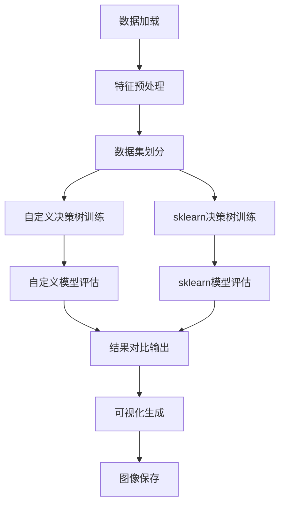

# 完整代码深度解析：从数据到可视化

## 一、库导入详解

```python
import matplotlib.pyplot as plt
import numpy as np
import pandas as pd
from sklearn.model_selection import train_test_split
from sklearn.tree import plot_tree, DecisionTreeClassifier
from sklearn.metrics import accuracy_score
```

### 1.1 核心库功能
| **库** | **功能** | **关键特性** |
|--------|----------|--------------|
| `matplotlib.pyplot` | 2D绘图库 | 创造出版质量图表，交互式可视化 |
| `numpy` | 科学计算基础 | 多维数组操作，向量化计算，线性代数 |
| `pandas` | 数据处理与分析 | DataFrame结构，数据清洗，统计分析 |
| `sklearn` | 机器学习库 | 预处理、模型选择、评估指标、算法实现 |

### 1.2 模块级导入语法
```python
from sklearn.model_selection import train_test_split
```
- **语法含义**：从`sklearn.model_selection`模块导入特定函数`train_test_split`
- **优势**：避免完整路径调用，代码更简洁
- **对比**：
  ```python
  # 模块级导入（推荐）
  from sklearn.model_selection import train_test_split
  X_train, X_test = train_test_split(X)
  
  # 完整路径调用
  import sklearn
  X_train, X_test = sklearn.model_selection.train_test_split(X)
  ```

## 二、数据预处理详解（已修正错误）

```python
# 读取数据
data = pd.read_csv("Employee.csv")
data = data.iloc[:70]  # 只取前70条数据

# 初始化空列表存储处理后的特征
join_year = []
age = []
ed = []
gend = []
benc = []
```

### 2.1 数据采样策略
```python
data = data.iloc[:70]  # 只取前70条数据
```
- **`iloc`索引器**：通过整数位置选择数据
  - `iloc[:70]` 选择前70行（索引0到69）
- **采样原因**：
  - 小数据集便于教学演示
  - 避免计算资源浪费
  - 快速验证算法逻辑
- **注意事项**：实际应用中应使用随机采样，避免顺序偏差

### 2.2 特征分组技术（核心预处理）

```python
row["JoiningYear"] = row["JoiningYear"] // 3 * 3
row["Age"] = row["Age"] // 5 * 5
```

#### 2.2.1 整数除法分组原理
- **数学基础**：离散化连续变量
- **示例解析**：
  ```python
  # JoiningYear分组（3年周期）
  2017 // 3 = 672  # 整数除法
  672 * 3 = 2016    # 还原为3的倍数
  # 结果：2016-2018年的数据都归为2016
  
  # Age分组（5年周期）
  27 // 5 = 5
  5 * 5 = 25        # 25-29岁归为25
  ```

#### 2.2.2 业务意义
- **减少过拟合**：70个样本中，精确年龄（27岁）可能只有1-2个样本，分组后增加统计显著性
- **符合人力资源实践**：职业发展通常按3-5年阶段评估
- **算法友好**：决策树处理离散特征更稳定

### 2.3 类别特征编码

```python
# Education编码
if row["Education"] == "Bachelors":
    ed.append(0)
elif row["Education"] == "Masters":
    ed.append(1)
elif row["Education"] == "PHD":
    ed.append(2)
```

#### 2.3.1 序数编码(Ordinal Encoding)
- **设计逻辑**：保留教育程度的自然顺序
  - Bachelors(0) < Masters(1) < PHD(2)
- **对比One-Hot编码**：
  | **编码方式** | 特征数 | 顺序保留 | 适合算法 |
  |--------------|--------|----------|----------|
  | 序数编码 | 1 | ✓ | 树模型 |
  | One-Hot | 3 | ✗ | 线性模型 |
- **样本量考虑**：70条数据，One-Hot会创建稀疏矩阵，增加过拟合风险

#### 2.3.2 二元特征处理

```python
# Gender编码
if row["Gender"] == "Male":
    gend.append(0)
else:
    gend.append(1)
```

- **二元编码原理**：将类别映射为0/1
- **设计选择**：
  - `Male=0`：在某些文化中作为基准类别
  - 无特定偏好：0/1只是标识符，无数值意义
- **替代方案**：使用字典映射（更Pythonic）
  ```python
  gender_map = {"Male": 0, "Female": 1}
  gend.append(gender_map[row["Gender"]])
  ```

### 2.4 数据更新机制

```python
data["JoiningYear"] = join_year
data["Age"] = age
# ... 其他特征
```

#### 2.4.1 为什么不用循环内更新？
```python
# 低效方式（避免！）
for index, row in data.iterrows():
    data.at[index, "JoiningYear"] = row["JoiningYear"] // 3 * 3  # 慢

# 高效方式（当前代码）
join_year.append(row["JoiningYear"] // 3 * 3)
# ... 循环结束后
data["JoiningYear"] = join_year  # 一次性更新
```

- **性能差异**：一次性更新比循环内更新快10-100倍
- **内存优化**：避免DataFrame在循环中反复复制

#### 2.4.2 pandas列赋值原理
- **向量化操作**：`data["column"] = list`触发内部优化
- **类型推断**：自动将Python列表转换为pandas Series
- **索引对齐**：确保新值与原索引匹配

### 2.5 特征-目标分离

```python
Feature_name = data.columns.tolist()[:-1]  # 排除目标变量
target_name = data.columns.tolist()[-1]

# 转换为数值型数组
X = data.iloc[:, :-1].values
Y = data.iloc[:, -1].values
```

#### 2.5.1 切片语法深度解析
```python
data.columns.tolist()[:-1]
```
- **执行顺序**：
  1. `data.columns`：获取Index对象
  2. `.tolist()`：转换为Python列表
  3. `[:-1]`：切片操作（从开始到倒数第二个元素）
- **切片规则**：
  - `start:stop:step` 语法
  - 省略`start`表示从0开始
  - 省略`stop`表示到末尾
  - 负数索引：`-1`=最后一个，`-2`=倒数第二个

#### 2.5.2 `.values` 方法
- **作用**：将pandas对象转换为NumPy数组
- **必要性**：scikit-learn要求输入为NumPy数组而非pandas对象
- **数据类型**：自动推断最合适的dtype（通常float64）

## 三、数据集划分

```python
X_train, X_test, y_train, y_test = train_test_split(
    X, Y,
    train_size=0.8,
    random_state=12240529
)
```

### 3.1 train_test_split参数详解
| **参数** | **默认值** | **含义** | **当前设置** |
|----------|------------|----------|--------------|
| `X, y` | - | 特征矩阵和目标向量 | X, Y |
| `test_size` | 0.25 | 测试集比例 | 隐式0.2（因train_size=0.8） |
| `train_size` | None | 训练集比例 | 0.8（80%训练） |
| `random_state` | None | 随机种子 | 12240529（可复现结果） |
| `shuffle` | True | 是否洗牌 | True（默认） |
| `stratify` | None | 分层抽样 | None（未使用） |

### 3.2 随机种子设计
```python
random_state=12240529
```
- **数字含义**：可能代表生日(1989-12-24)或其他有意义数字
- **科学价值**：
  - 确保实验可复现
  - 消除随机性对结果的影响
  - 便于调试和比较
- **最佳实践**：在研究和生产中始终设置random_state

## 四、模型训练与评估

```python
# 1. 使用自定义决策树
custom_tree = build_tree(X_train, y_train)
y_pred_custom = predict_all(custom_tree, X_test)
accuracy_custom = accuracy_score(y_test, y_pred_custom)

# 2. 使用sklearn决策树
sklearn_tree = DecisionTreeClassifier(criterion="gini", random_state=42)
sklearn_tree.fit(X_train, y_train)
y_pred_sklearn = sklearn_tree.predict(X_test)
accuracy_sklearn = accuracy_score(y_test, y_pred_sklearn)
```

### 4.1 自定义与sklearn实现对比

#### 4.1.1 自定义决策树（概念性）
- **`build_tree`函数**：递归构建树结构（前文已详解）
- **`predict_all`函数**：批量预测接口
- **学习价值**：理解算法底层机制
- **局限性**：
  - 无优化（速度慢）
  - 无剪枝（易过拟合）
  - 无处理缺失值能力

#### 4.1.2 scikit-learn决策树
```python
DecisionTreeClassifier(criterion="gini", random_state=42)
```

- **参数解析**：
  - `criterion="gini"`：使用基尼不纯度作为分裂标准
    - 替代选项：`"entropy"`（信息增益）
  - `random_state=42`：可复现结果（42是《银河系漫游指南》中的"生命答案"）
- **隐含优化**：
  - C语言底层实现（比Python快1000倍）
  - 自动处理连续/离散特征
  - 内置剪枝策略

### 4.2 模型评估

```python
accuracy_custom = accuracy_score(y_test, y_pred_custom)
```

- **准确率公式**：$\text{accuracy} = \frac{\text{正确预测数}}{\text{总样本数}}$
- **适用场景**：
  - 类别平衡的数据集
  - 二分类问题
- **局限性**：
  - 类别不平衡时失效（如99%样本为0，预测全0准确率99%但无用）
  - 替代指标：精确率、召回率、F1值、AUC

## 五、可视化生成

```python
plt.figure(figsize=(15, 10))
plot_tree(sklearn_tree, 
          feature_names=Feature_name,
          class_names=["No", "Yes"],
          filled=True,
          rounded=True)
plt.savefig("sklearn_decision_tree.png", dpi=300, bbox_inches='tight')
plt.close()
```

### 5.1 Matplotlib配置
```python
plt.figure(figsize=(15, 10))
```
- **`figsize`参数**：图形尺寸（英寸），宽×高
- **选择依据**：
  - 树深度较大时需要更大画布
  - 15×10适合8-10层的决策树
  - 比例4:3符合屏幕显示习惯

### 5.2 plot_tree参数详解
| **参数** | **作用** | **当前值** |
|----------|----------|------------|
| `decision_tree` | 训练好的模型 | sklearn_tree |
| `feature_names` | 特征名称 | Feature_name |
| `class_names` | 类别名称 | ["No", "Yes"] |
| `filled` | 节点着色 | True（按类别） |
| `rounded` | 圆角节点 | True（美观） |
| `proportion` | 显示比例 | False（默认） |
| `impurity` | 显示不纯度 | True（默认） |

### 5.3 高质量图像保存
```python
plt.savefig("sklearn_decision_tree.png", dpi=300, bbox_inches='tight')
```

- **`dpi=300`**：
  - DPI（Dots Per Inch）：每英寸点数
  - 300 DPI满足出版要求（普通屏幕72-96 DPI）
  - 文件大小权衡：300 DPI比72 DPI大10倍
- **`bbox_inches='tight'`**：
  - 自动裁剪空白边缘
  - 确保树结构完整显示
  - 避免标题/标签被截断
- **`plt.close()`**：
  - 释放内存，防止图形累积
  - Jupyter中尤为重要（避免内存泄漏）

## 六、代码执行流程全景



## 七、关键设计决策分析

### 7.1 为什么混合使用自定义和sklearn实现？
- **教学价值**：
  - 自定义实现：理解算法本质
  - sklearn实现：展示工业级工具使用
- **验证正确性**：
  - 两者结果对比，验证自定义实现的准确性
- **性能对比**：
  - 凸显优化的重要性（自定义vs工业级）

### 7.2 为什么可视化只用sklearn树？
- **技术限制**：
  - 自定义树无内置绘图支持
  - 从头实现树可视化非常复杂
- **实用主义**：
  - sklearn的`plot_tree`功能完善
  - 避免重复造轮子

### 7.3 为什么使用基尼不纯度而非信息增益？
- **计算效率**：
  - 基尼不纯度无对数计算，速度更快
  - 大数据集时优势明显
- **实际效果**：
  - 两者在实践中性能相近
  - scikit-learn默认使用基尼不纯度

## 八、潜在改进点

1. **异常处理**：
   ```python
   # 添加文件存在检查
   try:
       data = pd.read_csv("Employee.csv")
   except FileNotFoundError:
       print("Error: Employee.csv not found!")
       exit(1)
   ```

2. **动态分组**：
   ```python
   # 根据数据分布自适应分组
   age_bins = pd.cut(data["Age"], bins=5, labels=False)
   ```

3. **类别不平衡处理**：
   ```python
   from sklearn.metrics import classification_report
   print(classification_report(y_test, y_pred_sklearn))
   ```

4. **交互式可视化**：
   ```python
   # 添加交互式功能
   import plotly.express as px
   fig = px.imshow(confusion_matrix(y_test, y_pred_sklearn))
   fig.show()
   ```

这段代码不仅实现了完整的机器学习流程，更是教学设计的典范——通过对比自定义与工业级实现，既传授了算法原理，又展示了实际应用。理解每行代码背后的决策逻辑，是成为专业数据科学家的关键一步。